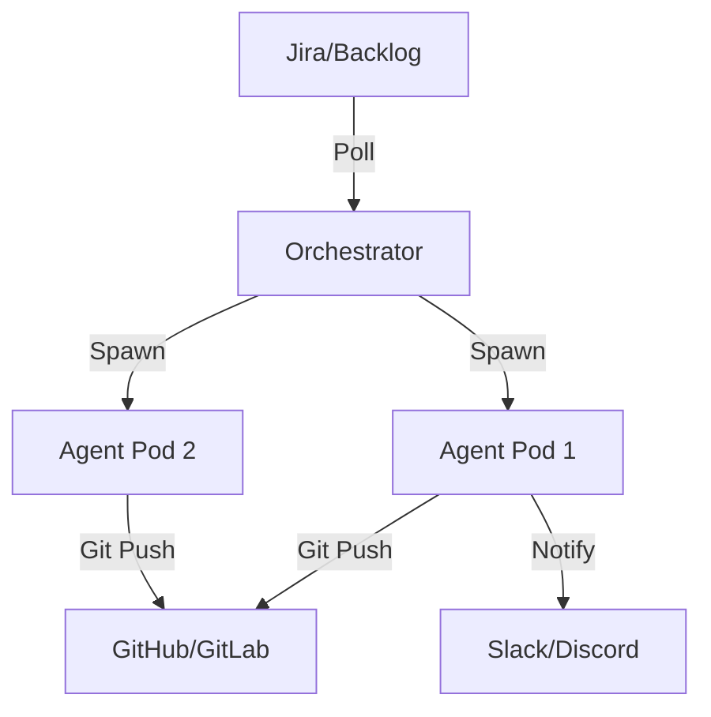

# recac - Rewrite of Combined Autonomous Coding

> [!WARNING] > **BINARY DEPRECATION**: The single `recac` binary is now deprecated.
> Please use the new distributed binaries:
>
> - **`orchestrator`**: For polling tasks (Jira/Files) and spawning agents.
> - **`recac-agent`**: The core autonomous coding agent.

`recac` is a comprehensive framework for autonomous coding. It has evolved from a single CLI tool into a distributed architecture designed for scale and reliability, particularly in Kubernetes environments.

## Features

- **🚀 Distributed Architecture**: Separate Orchestrator and Agent binaries for independent scaling.
- **🤖 Multi-Agent System**: Built-in support for Gemini, OpenAI, and Ollama.
- **🐳 Docker & K8s Native**: Run agents locally in Docker or as distributed Jobs in Kubernetes.
- **📋 Feature Tracking**: End-to-End feature lifecycle (Spec -> Implementation -> Verification).
- **📊 Real-time Monitoring**: TUI and Slack/Discord integrations for progress tracking.
- **🔄 Smart Orchestration**: Automatic Jira polling and agent lifecycle management.

## Project Structure & Documentation

The project is now divided into specialized components. Please refer to the specific documentation for each:

- [**Orchestrator**](file:///home/luke/repos/recac/cmd/orchestrator/README.md): How to manage the task pool and agent spawning.
- [**RECAC Agent**](file:///home/luke/repos/recac/cmd/agent/README.md): How the autonomous coding logic works and how to run it manually.
- [**E2E Testing**](file:///home/luke/repos/recac/e2e/README.md): Documentation for the scenario-based testing framework.
- [**Helm/K8s**](file:///home/luke/repos/recac/deploy/helm/recac/README.md): Guide for deploying to Kubernetes.

## Quick Start

### Prerequisites

- **Go 1.21+**
- **Docker** and **Docker Compose**
- **Git**
- **Kubernetes (Optional)** (e.g., k3s, minikube)

### Installation

```bash
# Clone the repository
git clone https://github.com/process-failed-successfully/recac.git
cd recac

# Build everything
make build
```

The `make build` command will produce:

- `bin/orchestrator`
- `bin/recac-agent`
- `bin/recac` (Legacy/CLI wrapper)

### Configuration

Create a `.recac.yaml` in your home directory.

```yaml
# AI Provider
agent_provider: openrouter
agent_model: "mistralai/devstral-2512:free"
api_key: "your-api-key"

# Integrations
jira_url: "https://your-domain.atlassian.net"
jira_email: "user@example.com"
jira_token: "api-token"
```

## Usage (Distributed Mode)

### 1. Run the Orchestrator

The orchestrator polls for work and starts agents.

```bash
# Local Docker mode
./bin/orchestrator --mode local --jira-label "recac-agent"
```

### 2. The Agent

The agent is usually spawned by the orchestrator, but can be run manually for debugging:

```bash
./bin/recac-agent --jira RD-123 --project "My Project" --repo-url "https://github.com/org/repo"
```

## Architecture

`recac` utilizes a **Poll-Spawn-Verify** loop:

1.  **Orchestrator**: Watches Jira (or a file) for new tasks matching a specific label.
2.  **Spawner**: Creates a Docker container or K8s Job for each task.
3.  **Agent**: Clones the repo, analyzes the task, implements the code, and pushes back.
4.  **Verification**: The agent runs QA checks and the manager signs off before completion.



## Workflow: Completing a Jira Ticket

1.  **Configure**: Ensure you have your AI provider and Jira credentials set in `.recac.yaml` or environment variables (see Configuration above).
2.  **Start Orchestrator**:
    ```bash
    # Polls Jira for tickets with label "recac-agent"
    ./bin/orchestrator --mode local --jira-label "recac-agent"
    ```
3.  **Create Ticket**: Create a Jira ticket with clear instructions in the description.
4.  **Label**: Add the label `recac-agent` to the ticket.
5.  **Watch**: The orchestrator will pick it up, spawn an agent, and comment on the ticket with progress.

## Generating Specifications (Architect Mode)

`recac` includes an "Architect Mode" to generate system architecture and contracts from a high-level spec.

1.  Create an `app_spec.txt` with your requirements:
    ```text
    A distributed crypto-currency trading bot that listens to Binance websocket, 
    calculates SMA(20), and executes trades via REST API.
    ```
2.  Run the architect command:
    ```bash
    recac architect --spec app_spec.txt --out .recac/architecture
    ```
3.  This will generate:
    - `architecture.yaml`: System components and data flow.
    - `contracts/*.yaml`: Interface definitions between components.
4.  **From Spec to Jira**: (Coming Soon) The orchestrator will soon support breaking down `architecture.yaml` into individual Jira tickets automatically.

## Deployment

### Kubernetes (Helm)

The recommended way to deploy `recac` in production is via the provided Helm chart.

1.  **Prerequisites**:
    - Kubernetes 1.19+
    - Helm 3.0+
    - Secrets for API keys (OpenAI/Gemini/Anthropic/Jira)

2.  **Install**:
    ```bash
    helm upgrade --install recac ./deploy/helm/recac \
      --namespace recac-system --create-namespace \
      --set config.provider=openrouter \
      --set config.model="mistralai/devstral-2512:free" \
      --set config.jiraUrl="https://your-domain.atlassian.net" \
      --set config.jiraUsername="user@example.com" \
      --set secrets.openrouterApiKey="$OPENROUTER_KEY" \
      --set secrets.jiraApiToken="$JIRA_TOKEN" \
      --set postgresql.enabled=true \
      --set config.dbType=postgres
    ```

3.  **Configuration**:
    See [deploy/helm/recac/README.md](deploy/helm/recac/README.md) for a full list of configuration options, including:
    - `config.maxIterations`: Limit agent loops (default: 20).
    - `config.managerFrequency`: How often the "Manager" AI reviews code (default: 5).
    - `persistence.enabled`: Enable persistent storage for agent workspaces.

### Docker Compose

For local testing without Kubernetes:

```bash
docker-compose up --build
```

To deploy the orchestrator in a Kubernetes cluster using Helm:

```bash
helm install recac ./deploy/helm/recac \
  --set secrets.apiKey=$API_KEY \
  --set config.jiraUrl=$JIRA_URL \
  --set config.jiraUsername=$JIRA_EMAIL \
  --set secrets.jiraApiToken=$JIRA_API_TOKEN
```

> [!NOTE]
> The orchestrator requires access to the Docker daemon to run agents. By default, the Helm chart mounts `/var/run/docker.sock` from the host. Ensure your Kubernetes nodes have Docker installed and the socket is accessible.

## Architecture

`recac` is built with a modular architecture:

- **cmd/**: CLI entry points (Cobra).
- **internal/agent/**: AI provider abstractions.
- **internal/runner/**: The core workflow loop and state management.
- **internal/docker/**: Docker API client wrappers.
- **internal/ui/**: TUI components (Bubble Tea).

## License

MIT
