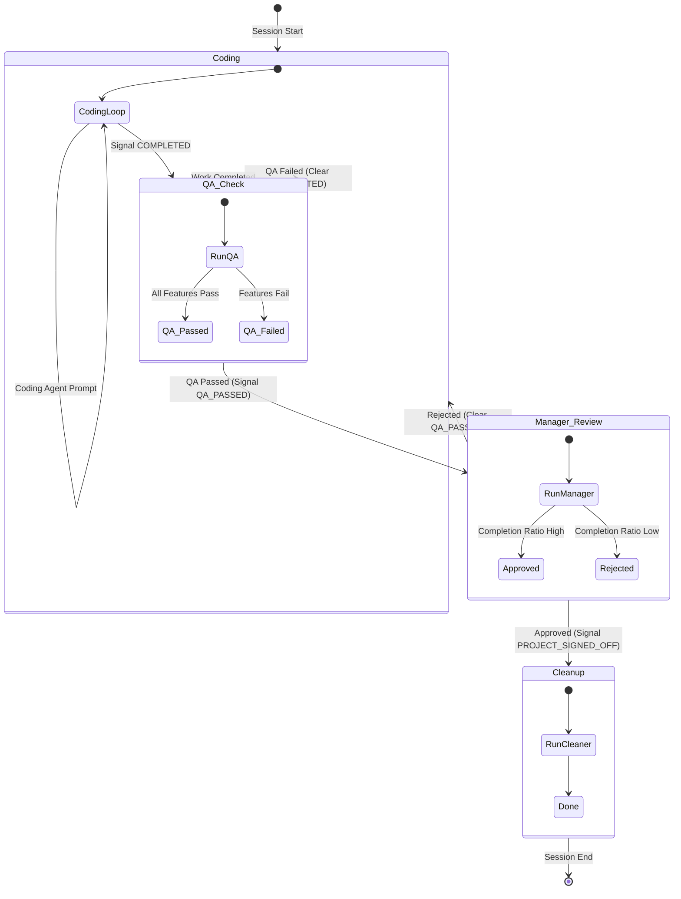

# Agent State Machine

This state diagram illustrates the lifecycle of the agent interactions, transitioning from Coding to QA, Manager Review, and finally Project Sign-off.

```mermaid
stateDiagram-v2
    [*] --> Coding: Session Start

    state Coding {
        [*] --> CodingLoop
        CodingLoop --> CodingLoop: Coding Agent Prompt
        CodingLoop --> QA_Check: Signal COMPLETED
    }

    state QA_Check {
        [*] --> RunQA
        RunQA --> QA_Passed: All Features Pass
        RunQA --> QA_Failed: Features Fail
    }

    state Manager_Review {
        [*] --> RunManager
        RunManager --> Approved: Completion Ratio High
        RunManager --> Rejected: Completion Ratio Low
    }

    state Cleanup {
        [*] --> RunCleaner
        RunCleaner --> Done
    }

    Coding --> QA_Check: Work Completed
    QA_Check --> Coding: QA Failed (Clear COMPLETED)
    QA_Check --> Manager_Review: QA Passed (Signal QA_PASSED)

    Manager_Review --> Coding: Rejected (Clear QA_PASSED)
    Manager_Review --> Cleanup: Approved (Signal PROJECT_SIGNED_OFF)

    Cleanup --> [*]: Session End
```
