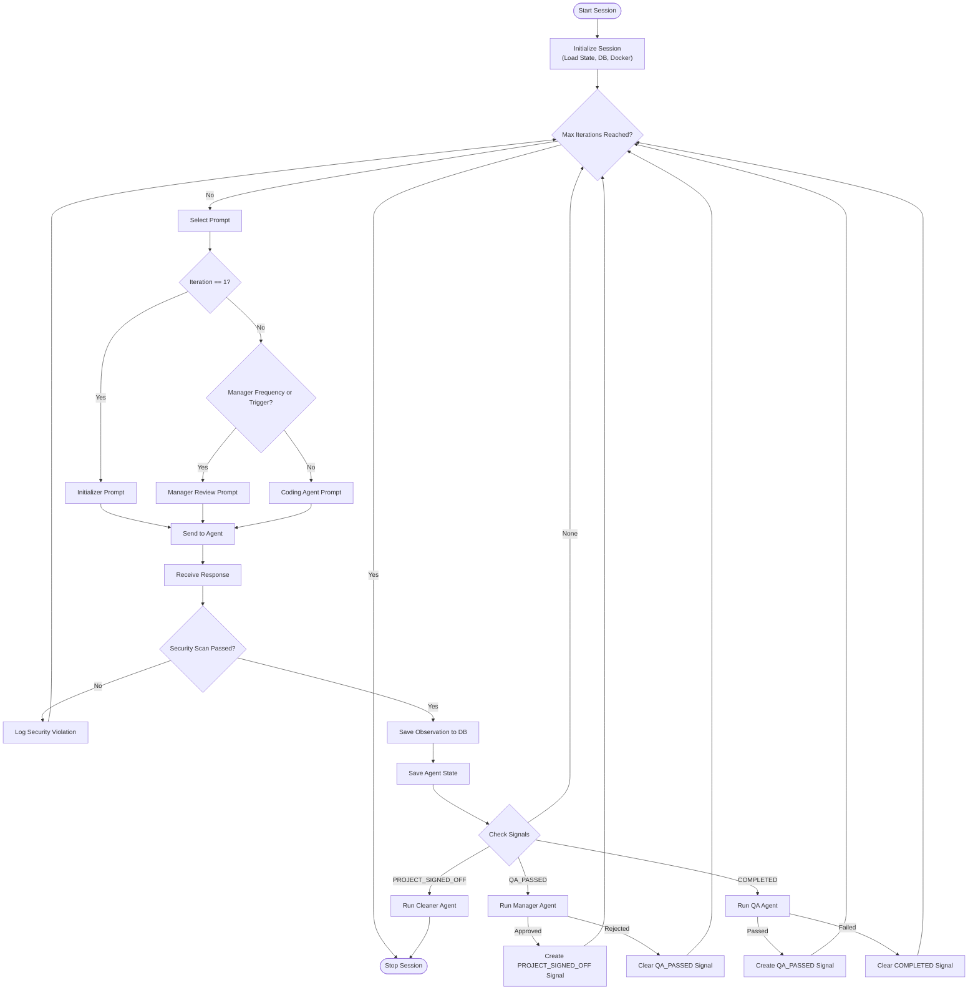

# Execution Loop Flow

This chart illustrates the main execution loop in `internal/runner/session.go`, specifically the `RunLoop` function. This loop drives the autonomous coding session.

```mermaid
flowchart TD
    Start([Start Session]) --> Init["Initialize Session\n(Load State, DB, Docker)"]
    Init --> LoopStart{Max Iterations Reached?}
    LoopStart -- Yes --> Stop([Stop Session])
    LoopStart -- No --> SelectPrompt[Select Prompt]

    SelectPrompt --> CheckIter{Iteration == 1?}
    CheckIter -- Yes --> PromptInit[Initializer Prompt]
    CheckIter -- No --> CheckManager{Manager Frequency or Trigger?}

    CheckManager -- Yes --> PromptManager[Manager Review Prompt]
    CheckManager -- No --> PromptCoding[Coding Agent Prompt]

    PromptInit --> SendAgent[Send to Agent]
    PromptManager --> SendAgent
    PromptCoding --> SendAgent

    SendAgent --> RecvResp[Receive Response]
    RecvResp --> SecScan{Security Scan Passed?}

    SecScan -- No --> LogSec[Log Security Violation]
    LogSec --> LoopStart

    SecScan -- Yes --> SaveDB[Save Observation to DB]
    SaveDB --> SaveState[Save Agent State]
    SaveState --> CheckSignals{Check Signals}

    CheckSignals -- PROJECT_SIGNED_OFF --> RunCleaner[Run Cleaner Agent]
    RunCleaner --> Stop

    CheckSignals -- QA_PASSED --> RunManager[Run Manager Agent]
    RunManager -- Approved --> CreateSignedOff[Create PROJECT_SIGNED_OFF Signal]
    RunManager -- Rejected --> ClearQAPassed[Clear QA_PASSED Signal]
    CreateSignedOff --> LoopStart
    ClearQAPassed --> LoopStart

    CheckSignals -- COMPLETED --> RunQA[Run QA Agent]
    RunQA -- Passed --> CreateQAPassed[Create QA_PASSED Signal]
    RunQA -- Failed --> ClearCompleted[Clear COMPLETED Signal]
    CreateQAPassed --> LoopStart
    ClearCompleted --> LoopStart

    CheckSignals -- None --> LoopStart
```
