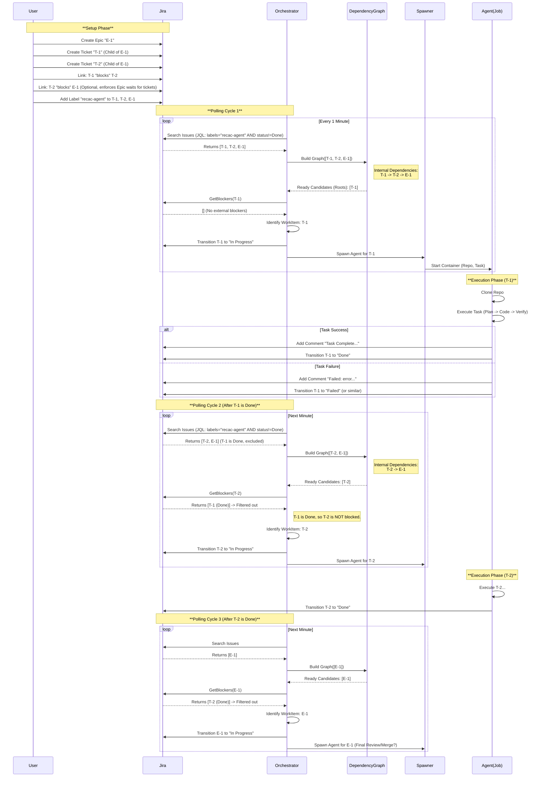

# Jira Epic Processing Flow

This diagram illustrates the detailed flow of how `recac` processes a Jira Epic containing multiple tickets.
The system relies on Jira Issue Links (specifically "blocks" / "is blocked by") to handle dependencies between tickets.

## Key Concepts

1.  **Epic & Tickets**: To `recac`, an Epic and its Child Tickets are all just "Issues" to be polled.
2.  **Dependencies**: Order is enforced via "Blocks" links. If Ticket A blocks Ticket B, `recac` will not process B until A is "Done".
3.  **Polling**: The Orchestrator periodically polls Jira for all relevant tickets.
4.  **External Blockers**: A ticket is only "Ready" if ALL its blockers (both those in the current batch and those outside it) are "Done".

