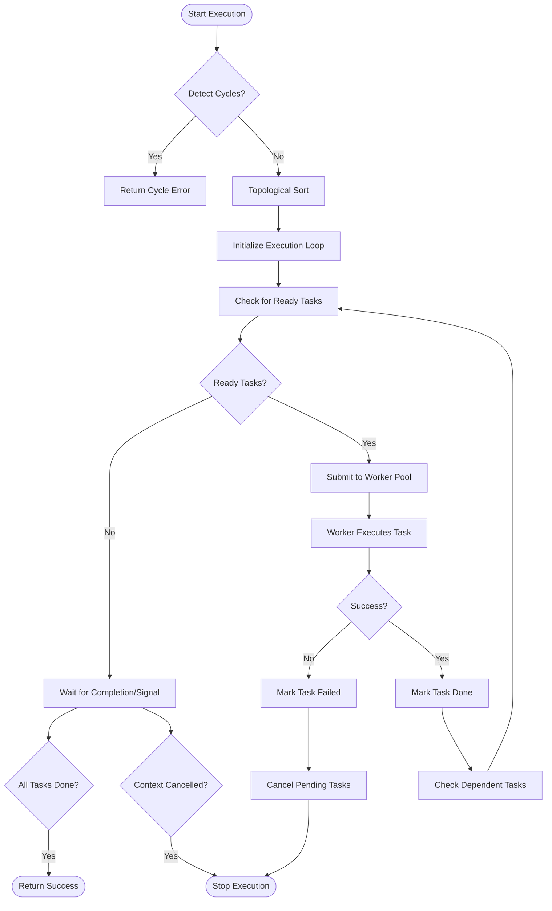

# Task Execution Flow

This chart details the `DependencyExecutor` logic in `internal/runner/dependency_executor.go`, showing how tasks are scheduled and executed based on dependencies.

```mermaid
flowchart TD
    Start([Start Execution]) --> DetectCycles{Detect Cycles?}
    DetectCycles -- Yes --> ErrorCycle[Return Cycle Error]
    DetectCycles -- No --> TopoSort[Topological Sort]

    TopoSort --> InitLoop[Initialize Execution Loop]
    InitLoop --> CheckReady[Check for Ready Tasks]

    CheckReady --> HasReady{Ready Tasks?}
    HasReady -- No --> Wait[Wait for Completion/Signal]
    HasReady -- Yes --> SubmitTask[Submit to Worker Pool]

    SubmitTask --> ExecWorker[Worker Executes Task]
    ExecWorker --> TaskResult{Success?}

    TaskResult -- No --> MarkFailed[Mark Task Failed]
    MarkFailed --> CancelAll[Cancel Pending Tasks]

    TaskResult -- Yes --> MarkDone[Mark Task Done]
    MarkDone --> CheckDeps[Check Dependent Tasks]
    CheckDeps --> CheckReady

    Wait --> AllDone{All Tasks Done?}
    AllDone -- Yes --> Success([Return Success])

    Wait --> ContextDone{Context Cancelled?}
    ContextDone -- Yes --> Stop([Stop Execution])

    CancelAll --> Stop
```
